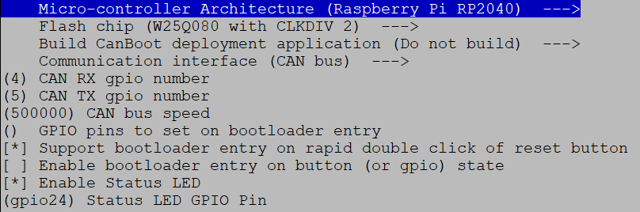

# CanBus, Canboot and how to get it all working + something extra

How to upload Canboot and klipper to Mellow SB2040 v1 CanBus board


## 1. Canboot

What is Canboot? This is a small bootloader that allows you to update the klipper without connecting USB, directly via CANBus. You do not need to disassemble the printer, connect the USB cable. Canboot is not required but recommended.

So here we go, we'll connect to our printer via SSH and move to our home folder:
```
cd ~
```

Let's download the latest version of CanBoot from git:
```
git clone https://github.com/Arksine/CanBoot
```

We move to the folder:
```
cd CanBoot
```

We will remove any previous compilations:
```
make clean
```

We will set up the HW for which we compile it:
```
make menuconfig
```

We set it as follows:



Do not forget to add: speed `500000` (or up to `1000000`) in the `CAN bus speed` box and `gpio24` in the `Status LED GPIO Pin` box.

We press `q` to save and `y` to confirm.

We compile using:
```
make -j4
```

(`-j4` just refines the compilation to run on 4 cores.)

Now upload the compiled CanBoot firmware to the SB2040 board:

We connect the USB cable to the RPI, press the USB-C button on the SB2040, and then release the button after connecting the USB cable. This will put the SB2040 in DFU (Device Firmware Update) mode and we can upload the firmware via USB.

Let's list the usb device:
```
lsusb
```

This should now appear in the list:
```
Bus 001 Device 014: ID 2e8a:0003
```

We write down two four characters for the ID, so in our case `2e8a:0003` it should be the same for all SB2040s, but it can be different in bucoucn.

We upload the CanBoot firmware:
```
make flash FLASH_DEVICE=2e8a:0003
```

## 2. Clipper firmware

Let's move to the klipper folder and download the latest update from git:
```
cd ~/clipper && git pull
```

We will remove the previous compilations:
```
make clean
```

We will set up the HW for which we compile it:
```
make menuconfig
```

We set it as follows:


Don't forget to add: speed `500000` (or up to `1000000`, it must be the same as we entered in the previous step) and `gpio24`.

We press `q` to save and `y` to confirm.

We compile:
```
make -j4
```

Now upload the firmware we compiled to the SB2040 board:

We connect the USB cable to the RPI, press the USB-C button on the SB2040, and then release the button after connecting the USB cable.

Let's list the usb device:
```
lsusb
```

You should see this:
```
Bus 001 Device 014: ID 2e8a:0003
```

We upload the klipper firmware
```
make flash FLASH_DEVICE=2e8a:0003
```

We will check
```
lsusb
```

and we should see:
```
Bus 001 Device 013: ID 1d50:614e OpenMoko, Inc.
```

The status led lights up:


## 3. Connecting and setting the canbus interface

Make sure you connect the 120 ohm CANBUS terminating resistor jumper to the SB2040:


You don't put any jumpers on the Mellow FLY-UTOC-1.

You connect according to the description if you have the version with sockets only, if you have the version with microfit connectors, then according to the color of the cables. If you have a multimeter, check the arrangement of the connectors to be sure, there should be a description on the PCB.
- +24V - Red
- 0V - Black
- CANBus-H - Yellow
- CanBus-L - White

Also connect 24V from the power supply to the UTOC


### Creating a Canbus interface:

We will install the packages we will need:
```
sudo apt update && sudo apt install nano wget -y
```

We will make the interface configuration. Let's open the `/etc/network/interfaces.d/can0` file using the `nano` text editor. We have to use `sudo` because this is a system file:
```
sudo nano /etc/network/interfaces.d/can0
```
And we insert the following text, **here set the speed you chose when compiling the firmware, in my case 500000**. :
```
allow-hotplug can0
iface can0 can static
     bit rate 500000
     up ifconfig $IFACE txqueuelen 1024
     pre-up ip link set can0 type can bitrate 500000
     pre-up ip link set can0 txqueuelen 1024
```

We save by pressing `Ctrl + O` (save the file), `Enter` to confirm the file name and `Ctrl + X` to close the editor (you can see these shortcuts below in the editor).

Let's restart the RPI:
```
sudo reboot
```

### Detecting canbus uuid

Let's move to the klipper folder:
```
cd ~/clipper
```

We find out with the command:
```
python3 lib/canboot/flash_can.py -q
```

We get the answer:
```
pi@Voron:~/klipper $ python3 lib/canboot/flash_can.py -q
Resetting all bootloader node IDs...
Checking for canboot nodes...
Detected UUID: 211e59ecf887, Application: Klipper
Query Complete
```

My CanBus UUID detected is: `211e59ecf887` yours will be different, copy yours !!!!


## 4. SB2040 configuration in printer.cfg


Add canbus mcu to printer.cfg:
```
[mcu sb2040]
canbus_uuid: write-your-id-here # your uu id

## SB2040 RPI sensor
[temperature_sensor FLY-SB2040]
sensor_type: temperature_mcu
sensor_mcu: sb2040

## SB2040 temperature sensor board
[temperature_sensor SB-inside]
sensor_type = ATC Semitec 104GT-2
sensor_pin = sb2040:gpio26


[controller_fan sb2040-fan]
## SB2040 5V fan
pin: sb2040:gpio15
kick_start_time: 0.5 # full speed to spin of fan
fan_speed: 0.9 #reduce speed to 90%
heater: heater_bed # enabled when heater bed heating
idle_timeout:30

[adxl345]
cs_pin: sb2040:gpio1
spi_software_sclk_pin: sb2040:gpio0
spi_software_mosi_pin: sb2040:gpio3
spi_software_miso_pin: sb2040:gpio2


[extruder]
step_pin: sb2040:gpio9
dir_pin: sb2040:gpio10
enable_pin: !sb2040:gpio7
rotation_distance: 22.6789511 #Bondtech 5mm Drive Gears

gear_ratio: 50:10 #Gear Ratio Stealthburner
microsteps: 32
full_steps_per_rotation: 200 #200 for 1.8 degree, 400 for 0.9 degree
nozzle_diameter: 0.400
filament_diameter: 1.75
heater_pin: sb2040:gpio6
sensor_type: Generic 3950
sensor_pin: sb2040:gpio27
min_temp: 10
max_temp: 280
max_power: 1.0
min_extrude_temp: 190
max_extrude_cross_section: 50.0
max_extrude_only_distance: 200
pressure_advance: 0.04
pressure_advance_smooth_time: 0.040

[tmc2209 extruder]
uart_pin: sb2040:gpio8
interpolate: false
run_current: 0.6
sense_resistor: 0.110
stealthchop_threshold: 0

#########################################
# Filament runout switch sensor
#########################################

[filament_switch_sensor runout_sensor]
pause_on_runout: True
runout_gcode:
#SET_LED LED=toolhead RED=1 GREEN=0 BLUE=0 INDEX=1 TRANSMIT=1
G91; relative positioning
G1 E-2 F2700
G1 Z10
G90; absolute positioning
G1 X250 Y50 F10000
G91
G1 E-100 F1000
insert_gcode:
#SET_LED LED=toolhead RED=0.5 GREEN=0.5 BLUE=0.0 WHITE=0.1 INDEX=1 TRANSMIT=1
G92 E0 ; Reset Extruder
G1 E50 F600 ; move filament down 50mm quickly
G1 E60 F300 ; extrude 60mm of filament slowly to get it through the nozzle
event_delay: 3.0
pause_delay: 0.5
switch_pin: !sb2040:gpio29

[probe] ## TAP
pin: sb2040:gpio28
x_offset: 0
y_offset: 0
#z_offset: 1
speed: 3.0
lift_speed: 7.0
samples: 3
samples_result: median
sample_retract_dist: 2.0
samples_tolerance: 0.006
samples_tolerance_retries: 3
activate_gcode:






     { action_respond_info('Extruder temperature target of %.1fC is too high, lowering to %.1fC' % (TARGET_TEMP, PROBE_TEMP)) }
     M109 S{ PROBE_TEMP }

     # Temperature target is already low enough, but the nozzle may still be too hot.
     
         { action_respond_info('Extruder temperature %.1fC is still too high, waiting until below %.1fC' % (ACTUAL_TEMP, MAX_TEMP)) }
         TEMPERATURE_WAIT SENSOR=extruder MAXIMUM={ MAX_TEMP }
     

```

## 5. Update SB2040 firmware via CanBus interface:

The procedure is the same as in point 2:

### We will compile the firmware

We go into the klipper folder and download the latest update from git:
```
cd ~/clipper && git pull
```

We will remove the previous compilations:
```
make clean
```

We will set up the HW for which we compile it:
```
make menuconfig
```

We set it as follows:


Don't forget to add: speed **500000, or up to 1000000 and gpio24**

We press `q` to save and `y` to confirm

We compile:
```
make -j4
```

Let's stop the clipper
```
sudo service clipper stop
```

Now upload the firmware we compiled to the SB2040 board:
```
python3 ~/klipper/lib/canboot/flash_can.py -i can0 -f ~/klipper/out/klipper.bin -u <VASE-CANBUS-ID>
```

It should look like this:


Let's start klipper again:
```
sudo service clipper start
```

## 6. Sensorless homing

When we got rid of a bunch of cabling, it is unnecessary to use endstops on XY. Here we will show you how to easily edit on the Octopus board.

### Connection
We disconnect the existing endstops, on the octopus board we connect jumpers DIAG pins for AB motors:


### Configuration of endstops:

Original state:
```
[stepper_x]
# …
endstop_pin: !PG6
# …
homing_retract_dist: 5

[tmc2209 stepper_x]
# …

[stepper_y]
# …
endstop_pin: !PG9
# …
homing_retract_dist: 5

[tmc2209 stepper_y]
# …
```

After adjustment:
```
[stepper_x]
endstop_pin: tmc2209_stepper_x: virtual_endstop
# …
homing_retract_dist: 0

[tmc2209 stepper_x]
# …
diag_pin: ^PG6 # you will use the same pin you had set as endstop_pin!
driver_SGTHRS: 255 # 255 is the highest sensitivity for detection, 0 is the lowest sensitivity

[stepper_y]
# …
endstop_pin: tmc2209_stepper_y: virtual_endstop
# …
homing_retract_dist: 0

[tmc2209 stepper_y]
# …
diag_pin: ^PG9 # you will use the same pin you had set as endstop_pin!
driver_SGTHRS: 255 # 255 is the highest sensitivity for detection, 0 is the lowest sensitivity
```

We save the config - save & restart

### Tuning impact sensitivity

We change the sensitivity, where the value 255 is the largest and 0 is the smallest, by setting 255 from the beginning and gradually reducing it so that the impact does not stop somewhere in the middle, but only after it hits the gantry and it is not too strong.

We set the sensitivity:
```
SET_TMC_FIELD FIELD=SGTHRS STEPPER=stepper_x VALUE=255
```

We will make a home
```
G28 X0
```

Alternatively, we move back in the X -10 GUI for another test:
```
G91
G1 X-10 F6000
G90
```

We'll change the aim again, and instead of 255, we'll set it a little lower until you're happy.

**We repeat the same procedure for the Y axis**

We set the sensitivity:
```
SET_TMC_FIELD FIELD=SGTHRS STEPPER=stepper_y VALUE=255
```

Let's do a home on the Y axis:
```
G28 Y0
```

Alternatively, we move back in the YX -10 GUI for another test:

G91
G1 Y-10 F6000
G90

In my case with Moons motors, I have both sensitivity values set to 70:
```
driver_SGTHRS: 70
```

### Macros
Perfection only lacks sensorless macros and the homing override that I use with TAP.

#### Homing_override macro

```
[homing_override]
axes: z
set_position_z: 0
gcode:
G90
G0 Z5 F600
_HOME_X
_HOME_Y
G90
G0 X175 Y175 F6600 ## this is for 350 version, overwrite your size here, otherwise it won't do home center
G28 Z
G0 Z10 F3600
```


#### Sensorless macro

This adjusts the current to the motors at home and moves it a little bit from the end, leaving room for movement and a possible next home.

Add macros where you are used to using them.
```
[gcode_macro _HOME_X]
gcode:
     # Always use consistent run_current on A/B steppers during sensorless homing
     
     
     
     SET_TMC_CURRENT STEPPER=stepper_x CURRENT={HOME_CURRENT}
     SET_TMC_CURRENT STEPPER=stepper_y CURRENT={HOME_CURRENT}

     # Home
     G28 X
     # Move away
     G91
     G1 X-10 F1200
    
     # Wait just a second… (give StallGuard registers time to clear)
     G4 P1000
     # Set current during print
     SET_TMC_CURRENT STEPPER=stepper_x CURRENT={RUN_CURRENT_X}
     SET_TMC_CURRENT STEPPER=stepper_y CURRENT={RUN_CURRENT_Y}

[gcode_macro _HOME_Y]
gcode:
     # Set current for sensorless homing
     
     
     
     SET_TMC_CURRENT STEPPER=stepper_x CURRENT={HOME_CURRENT}
     SET_TMC_CURRENT STEPPER=stepper_y CURRENT={HOME_CURRENT}

     # Home
     G28 Y
     # Move away
     G91
     G1 Y-10 F1200

     # Wait just a second… (give StallGuard registers time to clear)
     G4 P1000
     # Set current during print
     SET_TMC_CURRENT STEPPER=stepper_x CURRENT={RUN_CURRENT_X}
     SET_TMC_CURRENT STEPPER=stepper_y CURRENT={RUN_CURRENT_Y}
```

## 7. Something extra ... how to upload new firmware to Octopus without turning the printer, inserting the SD card or the jumper

Format some small microSD to FAT32 and stick it into the Octopus board

Compile the firmware for your board as usual.

Let's stop the clipper:
```
sudo service clipper stop
```

Let's move to the folder where you have klipper:
```
cd ~/clipper
```

We will remove any previous compilations:
```
make clean
```

We will set up the HW for which we compile it:
```
make menuconfig
```
    
Let's set up - this is for the F446 v1.1 version:


We press `q` to save and `y` to confirm:
```
make -j4
```

Let's run the script, in my case Octopus version F446 v1.1:
```
./scripts/flash-sdcard.sh /dev/ttyACM0 btt-octopus-f446-v1.1
```

A successful upload then looks like this:


Let's start klipper again:
```
sudo service clipper start
```

**Now just turn off the entire printer via Mainsail or Fluid, after a while turn off the printer completely with the power switch, wait a while and turn it on again, Octopus will automatically download the new klipper firmware from the sd card.**

If you have a different type of board, we will list it with this command and find out if it can also be used with your board:
```
./scripts/flash-sdcard.sh -l
```

Pro tyto desky je zde podpora:
- btt-gtr
- btt-gtr-v1
- btt-octopus-f407-v1
- btt-octopus-f407-v1.0
- btt-octopus-f407-v1.1
- btt-octopus-f429-v1
- btt-octopus-f429-v1.0
- btt-octopus-f429-v1.1
- btt-octopus-f446-v1
- btt-octopus-f446-v1.0
- btt-octopus-f446-v1.1
- btt-octopus-pro-f429-v1.0
- btt-octopus-pro-f446-v1.0
- btt-skr-2-f407
- btt-skr-2-f429
- btt-skr-3
- btt-skr-e3-dip
- btt-skr-e3-turbo
- btt-skr-mini
- btt-skr-mini-e3-v1
- btt-skr-mini-e3-v1.2
- btt-skr-mini-e3-v2
- btt-skr-mini-e3-v3
- btt-skr-mini-mz
- btt-skr-mini-v1.1
- btt-skr-mini-v3
- btt-skr-pro
- btt-skr-pro-v1.1
- btt-skr-pro-v1.2
- btt-skr-se-bx
- btt-skr-turbo-v1.4
- btt-skr-v1.1
- btt-skr-v1.3
- btt-skr-v1.4
- btt002-v1
- creality-v4.2.2
- creality-v4.2.7
- fly-gemini-v2
- flyboard-mini
- fysetc-cheetah
- fysetc-cheetah-v2
- fysetc-s6-v1.2
- fysetc-s6-v2
- fysetc-spider
- fysetc-spider-v1
- generic-lpc1768
- generic-lpc1769
- mks-robin-e3
- mks-robin-e3d
- mks-sbase
- mks-sgenl-v1
- mks-sgenl-v2
- monster8
- robin_v3
- smoothieboard-v1

## 8. One more thing :)

CanBus with Rpi SB2040 and motor driver needs cooling, especially if you print in a closed box. For the Stealthburner, I modified the door to accommodate a 25x25x7mm and 30x30x7mm fan. The cooler of the motor driver needs to be sawn roughly in half, to be sure, also glue some cooler to the RP2040.

At the end, I also designed an umbilical mod. So there is no need for chains.

You can find the models here: https://www.printables.com/cs/social/122655-locki/models


If you find any nonsense, inaccuracy, typo, etc., write to discord, I will correct it.
